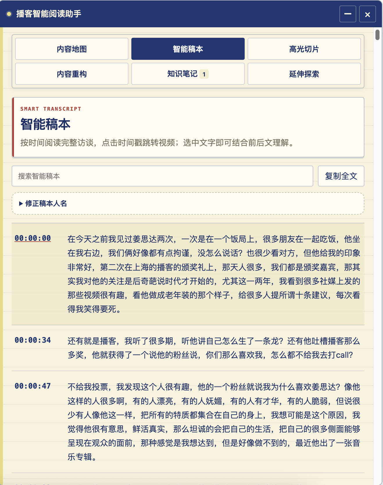
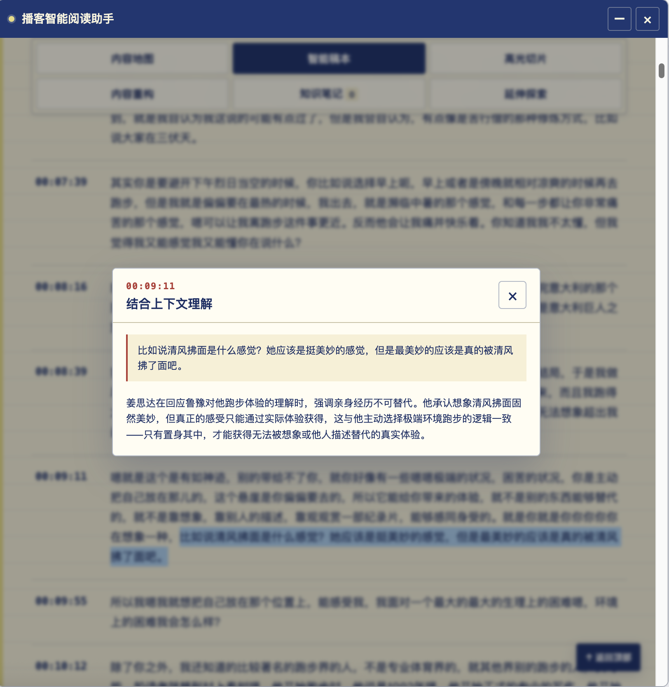
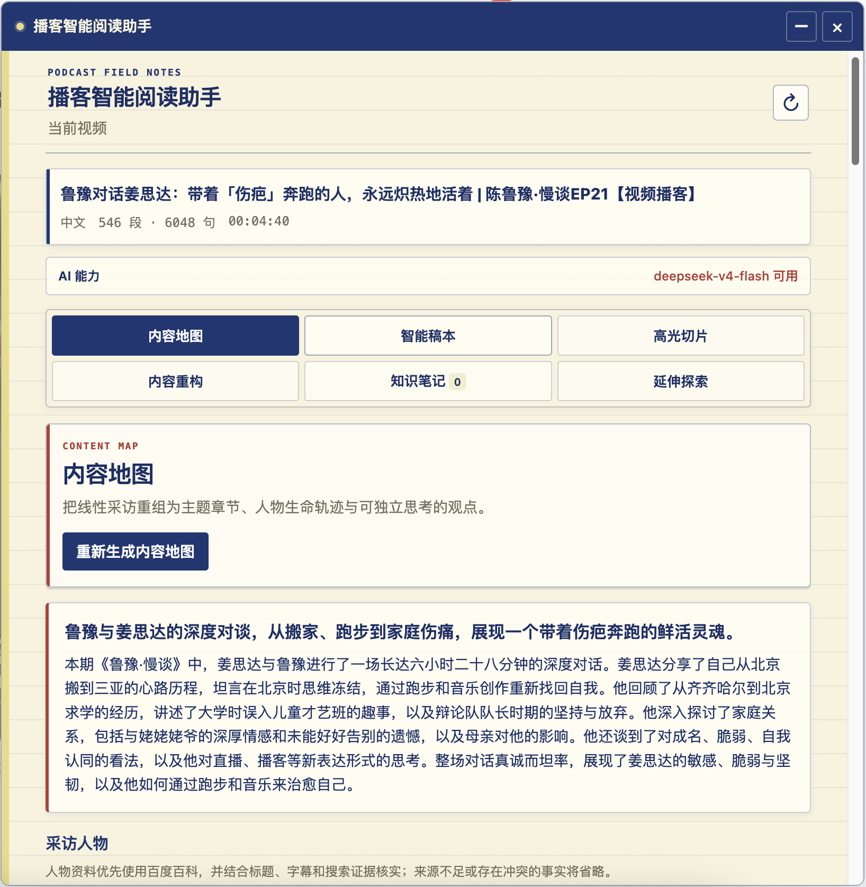
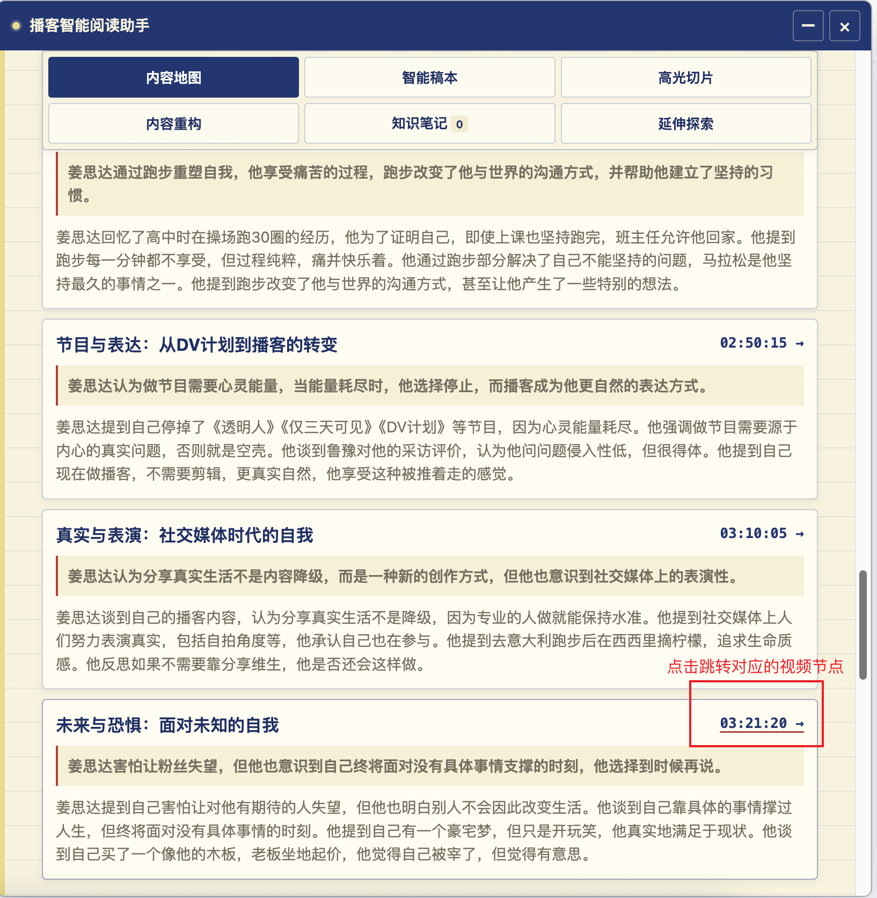
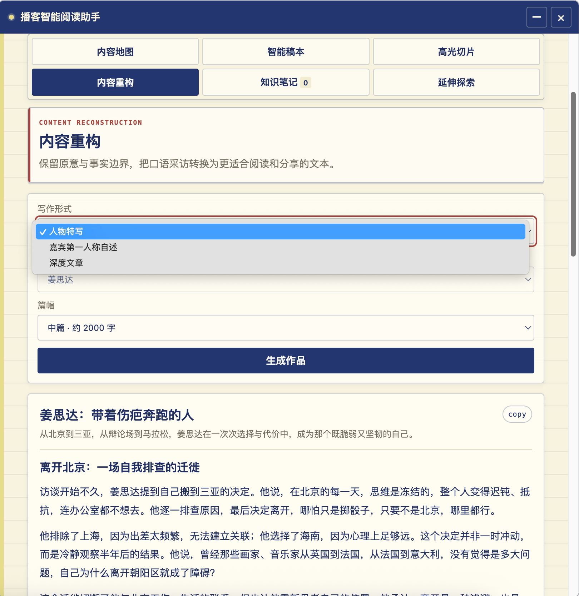

# 播客智能阅读助手

一款面向 Bilibili 访谈、播客和长视频的 Edge 浏览器扩展。它可以读取视频字幕并生成智能稿本、内容地图、高光切片、人物资料、知识笔记和深度文章。


当前扩展版本：`v1.0.24`

- [v1.0.19 版本说明](docs/v1.0.19-release-notes.md)
- [v1.0.18 版本说明](docs/v1.0.18-release-notes.md)
- [v1.0.17 版本说明](docs/v1.0.17-release-notes.md)
- [v1.0.16 版本说明](docs/v1.0.16-release-notes.md)
- [v1.0.15 版本说明](docs/v1.0.15-release-notes.md)
- [扩展完整使用说明](extension/README.md)
- [Vercel 部署说明](DEPLOYMENT.md)

## 主要功能

- 智能稿本：读取 Bilibili 中文字幕，合并成带时间戳的智能稿本；点击时间戳跳转视频，并随播放进度高亮当前内容；选中文字既可以结合前后文理解。
<div align="center">




</div>

- 内容地图：生成人物资料、采访主题地图、人物生命轨迹、思想金句；人物资料优先检索百度百科，并结合视频上下文校验身份；支持人工修正字幕中的错误姓名，例如 `叶利静 → 易立竞`；支持自然语言纠错，由 AI 核实后更新人物和内容信息

<div align="center">







</div>

- 高光切片：生成8 至 10 个高光切片为每个高光片段便于长视频播客在短视频上的传播，推荐 3 首适配该片段的歌曲bgm，并提供抖音搜索入口
<div align="center">


</div>


- 内容重构：被采访者可分别选择生成人物特写或第一人称自述、深度文章，可以选择1000字、2000字、3000字。
- 支持视频AI问答、知识笔记
- 延伸探索会为每位嘉宾分别推荐资料

<div align="center">




</div>


- AI 功能仅使用用户自己的 DeepSeek Key，由插件直连 DeepSeek；无需后端

## 普通用户安装

如果你拿到的是发布压缩包：

1. 解压 `broadcast-agent-extension.zip`。
2. 打开 `edge://extensions`。
3. 开启“开发者模式”。
4. 点击“加载已解压的扩展程序”。
5. 选择解压后的扩展文件夹。
6. 打开并刷新 Bilibili 视频页面，然后点击扩展图标。

普通用户不需要下载整个源码仓库。AI 功能需要填写自己的 DeepSeek API Key；字幕阅读、笔记无需 Key。

## 从源码构建

要求 Node.js 18 或更高版本。

```bash
npm install

npm run package:extension
```

构建结果：

```text
dist/extension/
dist/broadcast-agent-extension.zip
```

开发环境也可以直接在浏览器扩展管理页加载仓库中的 `extension/`，无需运行本地代理。具体配置见[扩展完整使用说明](extension/README.md)。

## AI 服务配置

在插件“AI 能力”中填写自己的 DeepSeek API Key。默认使用 `deepseek-v4-flash`，聊天及联网搜索由插件后台直接请求 DeepSeek，费用由用户账户承担。无开发者 Key、每日免费额度、注册接口或 Vercel 依赖。

默认仅当前浏览器会话保存 Key，用户可主动选择在此设备记住。测试 Key 也会产生少量调用费用。

如曾部署旧代理，必须下线旧服务并撤销旧开发者 Key；详见 [发布说明](DEPLOYMENT.md)。

## 本地验证

```bash
npm test
npm run check
```

## 隐私与安全

- 不读取、保存或上传 Bilibili `SESSDATA`
- 只有用户主动使用 AI 功能时，相关字幕和问题才会直接发送到 DeepSeek
- 开发者 API Key 不写入扩展源码或安装包；用户 Key 只由其浏览器保存
- 笔记、稿本修正和生成结果保存在浏览器本地，并按视频隔离

## 已知限制

- 视频没有可用中文字幕时，无法生成智能稿本
- AI 字幕可能识别错字，需要使用稿本人名修正功能
- 抖音歌曲只提供搜索跳转，不提供内嵌试听
- AI 可用性受用户 Key、账户余额、网络及 DeepSeek 服务状态影响

## 反馈问题

请在 [GitHub Issues](https://github.com/zhoujie97/broadcast-agent-extension/issues) 提交问题，并尽量附上：

- 浏览器与扩展版本
- 视频链接或 BV 号
- 操作步骤和错误提示
- 已隐藏密钥及个人信息的截图
