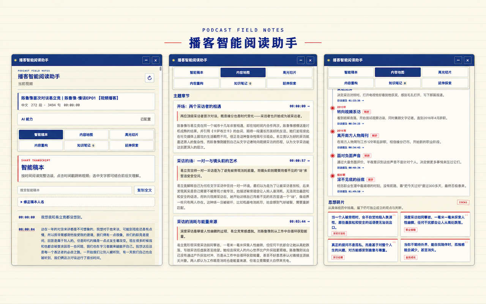
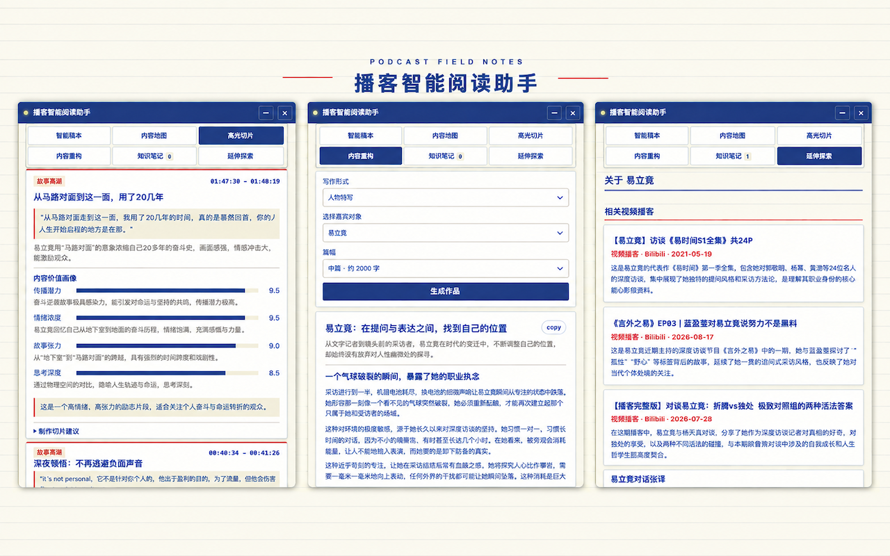

# 播客智能阅读助手

一款面向 Bilibili 访谈、播客和长视频的 Edge 浏览器扩展。它可以读取视频字幕并生成智能稿本、内容地图、高光切片、人物资料、知识笔记和深度文章。

当前扩展版本：`v1.0.25`

## 主要功能

- 智能稿本：读取 Bilibili 中文字幕，合并成带时间戳的智能稿本；点击时间戳跳转视频，并随播放进度高亮当前内容；选中文字既可以结合前后文理解。

- 内容地图：生成人物资料、采访主题地图、人物生命轨迹、思想金句；人物资料优先检索百度百科，并结合视频上下文校验身份；支持人工修正字幕中的错误姓名，例如 `叶利静 → 易立竞`；支持自然语言纠错，由 AI 核实后更新人物和内容信息

- 高光切片：生成8 至 10 个高光切片为每个高光片段便于长视频播客在短视频上的传播，推荐 3 首适配该片段的歌曲bgm，并提供抖音搜索入口

- 内容重构：被采访者可分别选择生成人物特写或第一人称自述、深度文章，可以选择1000字、2000字、3000字。
- 支持视频AI问答、知识笔记
- 延伸探索会为每位嘉宾分别推荐资料

- AI 功能仅使用用户自己的 DeepSeek Key，由插件直连 DeepSeek；无需后端

## 普通用户安装

1. 打开edge浏览器，搜索https://microsoftedge.microsoft.com/addons/detail/bfgmhgfjfhckjblpnhpmmeinecpceihe。
2. 点击“获取”添加扩展。
3. 打开bilibili任意长视频播客，点击浏览器右上角扩展图标。

AI 功能需要填写自己的 DeepSeek API Key；智能稿本、知识笔记无需 Key。

## AI 服务配置

在插件“AI 能力”中填写自己的 DeepSeek API Key。默认使用 `deepseek-v4-flash`，聊天及联网搜索由插件后台直接请求 DeepSeek，费用由用户账户承担。

默认仅当前浏览器会话保存 Key，用户可主动选择在此设备记住。测试 Key 也会产生少量调用费用。

## 隐私与安全

- 不读取、保存或上传 Bilibili `SESSDATA`
- 只有用户主动使用 AI 功能时，相关字幕和问题才会直接发送到 DeepSeek
- 开发者 API Key 不写入扩展源码或安装包；用户 Key 只由其浏览器保存
- 笔记、稿本修正和生成结果保存在浏览器本地，并按视频隔离

## 已知限制

- 视频没有可用中文字幕时，无法生成智能稿本
- AI 字幕可能识别错字，需要使用稿本人名修正功能
- 抖音歌曲只提供搜索跳转，不提供内嵌试听
- AI 可用性受用户 Key、账户余额、网络及 DeepSeek 服务状态影响
